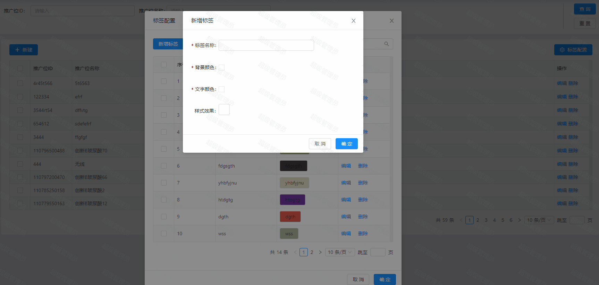
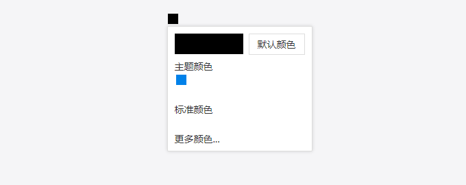

基于 Vue 的颜色选择器

> 背景：在开发后台系统的过程中，需要用到颜色选择器组件，而这个项目是基于没有`颜色选择器组件`的[AntDesignVue](https://2x.antdv.com/components/overview/)的 UI 框架进行开发的， 所以参照了[View UI](https://www.iviewui.com/components/color-picker)的颜色选择器组件的源码进行了一个基于 Vue 框架的颜色选择器组件的封装， 让这个颜色选择组件脱离框架的限制。



### 实现思路

- 首先需要有颜色显示的小方块，提供一个颜色选择的入口

- 通过入口，打开一个颜色面板，面板的主要内容有四大部分内容：顶部是左侧显示用户当先选择的颜色，右侧显示`默认颜色`按钮的快捷键 （自定义默认颜色）

- 中间的分为`主题颜色`区域以及`标准颜色`区域，主要是提供给用户常见的颜色选择快捷项

- 底部的`更多颜色`是提供三种颜色值格式：`HEX`、`RGB`、 `HSL`，让用户自定义颜色值

### 实现步骤

- 布局

  - 实现入口小方块样式

    

    ```vue
    <!-- ColorPicker.vue -->
    <template>
      <div class="zs-color-picker">
        <!-- 颜色选择入口 -->
        <div class="zs-color-picker-btn" :style="btnStyle" />

        <!-- 颜色选择面板 -->
        <div class="zs-color-picker-panel"></div>
      </div>
    </template>
    <script>
    export default {
      data() {
        return {
          // 自定入口按钮样式
          btnStyle: {},
        }
      },
    }
    </script>

    <style lang="less" scoped>
    .zs-color-picker {
      position: relative;
      text-align: left;
      font-size: 14px;
      display: inline-block;
      outline: none;

      ul,
      li,
      ol {
        list-style: none;
        margin: 0;
        padding: 0;
      }

      // 入口按钮， 默认宽高位15px
      &-btn {
        width: 15px;
        height: 15px;
        background-color: #000;
        cursor: pointer;
        border: 1px solid #eee;
      }
    }
    </style>
    ```

  * 在实现入口小方块的基础上继续完成颜色面板布局与样式
    

    ```vue
    <!-- ColorPicker.vue -->
    <template>
      <div class="zs-color-picker">
        <!-- 颜色选择入口 -->
        <div class="zs-color-picker-btn" :style="btnStyle" />

        <!-- 颜色选择面板 -->
        <div
          :class="[
            'zs-color-picker-panel',
            visible ? 'zs-color-picker-panel__visible' : '',
          ]"
        >
          <div class="panel-header">
            <div class="color-view" style="background-color: #000" />
            <div class="default-color">默认颜色</div>
          </div>

          <div class="panel-main">
            <h3>主题颜色</h3>
            <ul class="theme-color">
              <li :style="{ backgroundColor: '#0081e9' }" />
            </ul>
            <ul class="standard-color">
              <li>
                <ul>
                  <li></li>
                </ul>
              </li>
            </ul>

            <h3>标准颜色</h3>
            <ul class="theme-color">
              <li />
            </ul>

            <h3 style="cursor: pointer;">更多颜色...</h3>
            <input />
          </div>
        </div>
      </div>
    </template>
    <script>
    export default {
      data() {
        return {
          visible: true,
          // 自定入口按钮样式
          btnStyle: {},
        }
      },
    }
    </script>

    <style lang="less" scoped>
    .zs-color-picker {
      position: relative;
      text-align: left;
      font-size: 14px;
      display: inline-block;
      outline: none;

      ul,
      li,
      ol {
        list-style: none;
        margin: 0;
        padding: 0;
      }

      // 入口按钮， 默认宽高位15px
      &-btn {
        width: 15px;
        height: 15px;
        background-color: #000;
        cursor: pointer;
        border: 1px solid #eee;
      }

      // 颜色面板 初始状态隐藏
      &-panel {
        position: absolute;
        width: 190px;
        background: #fff;
        border: 1px solid #ddd;
        visibility: hidden;
        border-radius: 2px;
        margin-top: 2px;
        padding: 10px;
        padding-bottom: 5px;
        box-shadow: 0 0 5px rgba(0, 0, 0, 0.15);
        opacity: 0;
        transition: all 0.3s ease;
        box-sizing: content-box;

        h3 {
          margin: 0;
          font-size: 14px;
          font-weight: normal;
          margin-top: 10px;
          margin-bottom: 5px;
          line-height: 1;
          color: #333;
        }

        input {
          visibility: hidden;
          position: absolute;
          left: 0;
          bottom: 0;
        }

        .panel-header {
          overflow: hidden;
          line-height: 29px;
          .color-view {
            width: 100px;
            height: 30px;
            float: left;
            transition: background-color 0.3s ease;
          }

          .default-color {
            width: 80px;
            float: right;
            text-align: center;
            border: 1px solid #ddd;
            cursor: pointer;
            color: #333;
          }
        }

        .panel-main {
          .theme-color {
            li {
              width: 15px;
              height: 15px;
              display: inline-block;
              margin: 0 2px;
              transition: all 0.3s ease;
              cursor: pointer;
            }
            li:hover {
              box-shadow: 0 0 5px rgba(0, 0, 0, 0.4);
              transform: scale(1.3);
            }
          }

          .standard-color {
            li {
              width: 15px;
              display: inline-block;
              margin: 0 2px;
              li {
                display: block;
                width: 15px;
                height: 15px;
                transition: all 0.3s ease;
                margin: 0;
              }
              li:hover {
                box-shadow: 0 0 5px rgba(0, 0, 0, 0.4);
                transform: scale(1.3);
              }
            }
          }
        }
      }

      // 颜色面板显示状态
      &-panel__visible {
        visibility: visible;
        opacity: 1;
        z-index: 1;
      }
    }
    </style>
    ```

* 逻辑

  - 通过`Vue`的自定义指令，编写一个工具函数来阻止默认事件，通过这个函数使得我们只触发父元素的事件，其子元素的事件阻止被触发

    ```javascript
    // utils.js
    const nodeList = []
    const ctx = '@@clickoutsideContext'

    let startClick
    let seed = 0

    document.addEventListener('mousedown', (e) => (startClick = e))
    document.addEventListener('mouseup', (e) =>
      nodeList.forEach((node) => node[ctx].documentHandler(e, startClick))
    )

    function createDocumentHandler(el, binding, vnode) {
      return function(mouseup = {}, mousedown = {}) {
        if (
          !vnode ||
          !vnode.context ||
          !mouseup.target ||
          !mousedown.target ||
          el.contains(mouseup.target) ||
          el.contains(mousedown.target) ||
          el === mouseup.target ||
          (vnode.context.popperElm &&
            (vnode.context.popperElm.contains(mouseup.target) ||
              vnode.context.popperElm.contains(mousedown.target)))
        )
          return

        if (
          binding.expression &&
          el[ctx].methodName &&
          vnode.context[el[ctx].methodName]
        ) {
          vnode.context[el[ctx].methodName]()
        } else {
          el[ctx].bindingFn && el[ctx].bindingFn()
        }
      }
    }

    // 自定义指令 - 点击元素外面才会触发的事件
    export default {
      bind(el, binding, vnode) {
        nodeList.push(el)
        const id = seed++
        el[ctx] = {
          id,
          documentHandler: createDocumentHandler(el, binding, vnode),
          methodName: binding.expression,
          bindingFn: binding.value,
        }
      },

      update(el, binding, vnode) {
        el[ctx].documentHandler = createDocumentHandler(el, binding, vnode)
        el[ctx].methodName = binding.expression
        el[ctx].bindingFn = binding.value
      },

      unbind(el) {
        let len = nodeList.length

        for (let i = 0; i < len; i++) {
          if (nodeList[i][ctx].id === el[ctx].id) {
            nodeList.splice(i, 1)
            break
          }
        }
        delete el[ctx]
      },
    }
    ```

  - 编写颜色入口小方块逻辑，控制面板的显隐状态，以及对`style`进行更改以便动态改变背景颜色

    ```vue
    <!-- ColorPicker.vue -->
    <template>
      <div
        class="zs-color-picker"
        ref="colorPicker"
        v-click="closePanel"
        @click="(e) => e.stopPropagation()"
      >
        <!-- 颜色选择入口 -->
        <div
          class="zs-color-picker-btn"
          :style="{ backgroundColor: showColor, ...btnStyle }"
          @click="openPanel"
        />
        .....
      </div>
    </template>
    
    <script>
    import click from '../utils/utils'
    
    export default {
      name: 'color-picker',
    
      // 自定义 v-click命令
      directives: { click },
    
      props: {
        // 当前选中的颜色值
        value: {
          type: [String, undefined],
        },
    
        // 默认颜色
        defaultColor: {
          type: String,
          default: '#f5f5f5',
        },
    
        btnStyle: {
          type: [String, Object],
        },
      },
    
      data() {
        return {
          // 颜色面板显隐
          visible: false,
    
          // 自定入口按钮样式
          btnStyle: {},
        }
      },
    
      computed: {
        // 展示当前选中的颜色值
        showColor() {
          if (this.value) return this.value
          return this.defaultColor
        },
      },
    
      methods: {
        openPanel() {
          this.visible = !this.visible
        },
    
        closePanel() {
          this.visible = false
        },
      },
    }
    </script>
    ```

  - 接下来编写颜色面板的具体逻辑，首先给`主题颜色`以及`标准颜色`设置一些常用的默认值，并渲染出来；编写`gradientValue`函数计算渐变过渡颜色，`hexToRgb`将 hex 格式的颜色值转换为 rgb 值，`rgbToHex`函数将 rgb 格式的颜色值转换为 hex 值，`parseColor`格式化 hex 颜色值。

  - 接下来实现点击选中方块的颜色值并将选中的值返回给父元素，以及`更多颜色`根据不同的格式值来获取用户输入的颜色值，这里使用的是HTML5新增的对象—[Color对象](https://www.w3school.com.cn/jsref/dom_obj_color.asp)。

    

    ```vue
    <!-- ColorPicker.vue -->
    <template>
      <div
        class="zs-color-picker"
        ref="colorPicker"
        v-click="closePanel"
        @click="e => e.stopPropagation()"
      >
        <!-- 颜色选择入口 -->
        <div
          class="zs-color-picker-btn"
          :style="{ backgroundColor: showColor, ...btnStyle }"
          @click="openPanel"
        />
    
        <!-- 颜色选择面板 -->
        <div :class="['zs-color-picker-panel', visible ? 'zs-color-picker-panel__visible' : '']">
          <div class="panel-header">
            <div class="color-view" :style="`background-color: ${showPanelColor}`" />
            <div
              class="default-color"
              @mouseover="hoveColor = defaultColor"
              @mouseout="hoveColor = null"
              @click="handleDefaultColor"
            >
              默认颜色
            </div>
          </div>
    
          <div class="panel-main">
            <h3>主题颜色</h3>
            <ul class="theme-color">
              <li
                v-for="(color, index) of tColor"
                :key="index"
                :style="{ backgroundColor: color }"
                @mouseover="hoveColor = color"
                @mouseout="hoveColor = null"
                @click="updataValue(color)"
              />
            </ul>
            <ul class="standard-color">
              <li v-for="(item, index) of colorPanel" :key="index">
                <ul>
                  <li
                    v-for="(color, cindex) of item"
                    :key="cindex"
                    :style="{ backgroundColor: color }"
                    @mouseover="hoveColor = color"
                    @mouseout="hoveColor = null"
                    @click="updataValue(color)"
                  />
                </ul>
              </li>
            </ul>
    
            <h3>标准颜色</h3>
            <ul class="theme-color">
              <li
                v-for="(color, index) of bColor"
                :key="index"
                :style="{ backgroundColor: color }"
                @mouseover="hoveColor = color"
                @mouseout="hoveColor = null"
                @click="updataValue(color)"
              />
            </ul>
    
            <h3 @click="triggerHtml5Color" style="cursor: pointer;">更多颜色...</h3>
    
            <!-- HTML DOM Color 对象 -->
            <input
              type="color"
              ref="html5Color"
              v-model="html5Color"
              @change="updataValue(html5Color)"
            />
          </div>
        </div>
      </div>
    </template>
    
    <script>
    import click from '../utils/utils'
    
    export default {
      name: 'color-picker',
    
      // 自定义 v-click命令
      directives: { click },
    
      props: {
        // 当前选中的颜色值
        value: {
          type: [String, undefined]
        },
    
        // 默认颜色
        defaultColor: {
          type: String,
          default: '#000'
        },
    
        // 入口按钮样式
        btnStyle: {
          type: [String, Object]
        }
      },
    
      data() {
        return {
          // 颜色面板显隐
          visible: false,
    
          // 鼠标经过的颜色块
          hoveColor: null,
    
          // 用户输入的颜色值
          html5Color: this.value,
    
          // 主题颜色
          tColor: [
            '#000000',
            '#ffffff',
            '#eeece1',
            '#1e497b',
            '#4e81bb',
            '#e2534d',
            '#9aba60',
            '#8165a0',
            '#47acc5',
            '#f9974c'
          ],
    
          // 颜色面板
          colorConfig: [
            ['#7f7f7f', '#f2f2f2'],
            ['#0d0d0d', '#808080'],
            ['#1c1a10', '#ddd8c3'],
            ['#0e243d', '#c6d9f0'],
            ['#233f5e', '#dae5f0'],
            ['#632623', '#f2dbdb'],
            ['#4d602c', '#eaf1de'],
            ['#3f3150', '#e6e0ec'],
            ['#1e5867', '#d9eef3'],
            ['#99490f', '#fee9da']
          ],
    
          // 标准颜色
          bColor: [
            '#c21401',
            '#ff1e02',
            '#ffc12a',
            '#ffff3a',
            '#90cf5b',
            '#00af57',
            '#00afee',
            '#0071be',
            '#00215f',
            '#72349d'
          ]
        }
      },
    
      computed: {
        // 显示面板颜色
        showPanelColor() {
          if (this.hoveColor) {
            return this.hoveColor
          } else {
            return this.showColor
          }
        },
    
        // 展示当前选中的颜色值
        showColor() {
          if (this.value) return this.value
          return this.defaultColor
        },
    
        // 颜色面板
        colorPanel() {
          const colorArr = []
          for (let color of this.colorConfig) {
            colorArr.push(this.gradientValue(color[1], color[0], 5))
          }
          return colorArr
        }
      },
    
      methods: {
        openPanel() {
          this.visible = !this.visible
        },
    
        closePanel() {
          this.visible = false
        },
    
        triggerHtml5Color() {
          this.$refs.html5Color.click()
        },
    
        // 设置默认颜色
        handleDefaultColor() {
          this.updataValue(this.defaultColor)
        },
    
        // 更新组件的值 value
        updataValue(value) {
          this.$emit('input', value)
          this.$emit('change', value)
          this.visible = false
        },
    
        // 计算渐变过渡颜色
        gradientValue(startColor, endColor, step) {
          // 讲 hex 转换为 rgb
          const sColor = this.hexToRgb(startColor)
          const eColor = this.hexToRgb(endColor)
    
          // 计算R\G\B每一步的差值
          const rStep = (eColor[0] - sColor[0]) / step
          const gStep = (eColor[1] - sColor[1]) / step
          const bStep = (eColor[2] - sColor[2]) / step
    
          const gradientColorArr = []
          // 计算每一步的hex值
          for (let i = 0; i < step; i++) {
            gradientColorArr.push(
              this.rgbToHex(
                parseInt(rStep * i + sColor[0]),
                parseInt(gStep * i + sColor[1]),
                parseInt(bStep * i + sColor[2])
              )
            )
          }
          return gradientColorArr
        },
    
        // RGB 颜色 转 HEX 颜色
        rgbToHex(r, g, b) {
          const hex = ((r << 16) | (g << 8) | b).toString(16)
          return '#' + new Array(Math.abs(hex.length - 7)).join('0') + hex
        },
    
        // HEX 转 RGB 颜色
        hexToRgb(hex) {
          hex = this.parseColor(hex)
          const rgb = []
          for (let i = 1; i < 7; i += 2) {
            rgb.push(parseInt('0x' + hex.slice(i, i + 2)))
          }
          return rgb
        },
    
        // 格式化 hex 颜色值
        parseColor(hexStr) {
          if (hexStr.length === 4) {
            hexStr = '#' + hexStr[1] + hexStr[1] + hexStr[2] + hexStr[2] + hexStr[3] + hexStr[3]
          } else {
            return hexStr
          }
        }
      }
    }
    </script>
    
    ```

    ```vue
    <!-- App.vue -->
    <template>
      <div id="app">
        <ColorPicker v-model="color" />
      </div>
    </template>
    
    <script>
    import ColorPicker from './components/ColorPicker'
    
    export default {
      components: {
        ColorPicker,
      },
      data() {
        return { color: undefined }
      },
    }
    </script>
    ```

    

    ### 总结

    本质就是基于css绝对定位布局进行一个颜色预设值的选择，再提供一个input 框调用HTML5的`Color对象`的接口获取用户的颜色输入值，在返回给组件。

    完整项目地址： 

